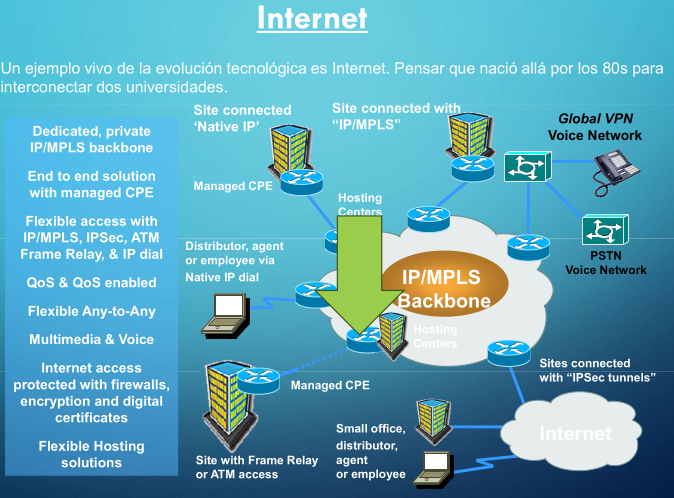
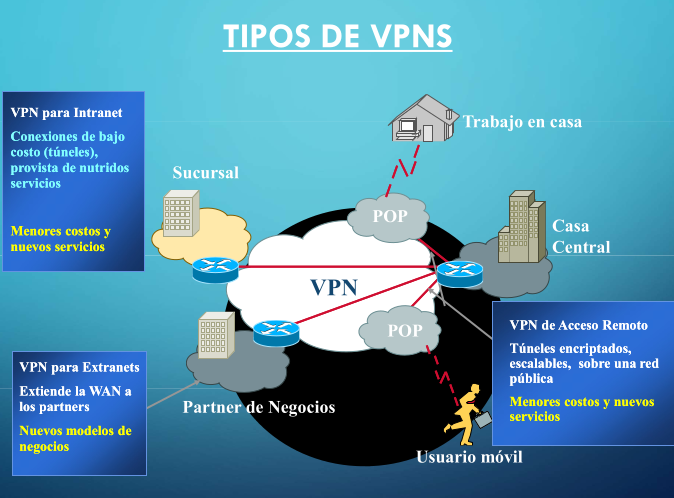

# Clase 2. Viernes 22/08

https://www.youtube.com/watch?v=SoocbjAmnnI&list=PLgjTEtKoGsVoxJIuvWQH-HLS33xVZTQj_&index=1&t=1895s

## Introduccion a las telecomunicaciones y redes.

Las telecomunicaciones han sufridos grandes cambios a partir del esquema telefónico (capacidad de digitalización de la voz). 

A partir de la capacidad de digitalizacion de la voz, asumen los roles las tramas de datos. Los 4kHz de ancho de banda de la voz, aplicado con el teorema de Nyquist -> estamos en 8kHz codificado con 8 bits en un conversor analogico digital, me entregan los famosos 64kb/s. Se lo conoce como la trama o el canal de voz sin compresion. De ahí arranca toda la jerarquia de comunicaciones que conocemos hasta el dia de la fecha. 

```
🔊 1. ¿Qué es la “frecuencia de la voz”?

La voz es un sonido → es una onda mecánica en el aire.

Como cualquier onda, está compuesta de muchas frecuencias (agudos, graves, armónicos).

En telefonía se decidió transmitir solo un rango de esas frecuencias: 300 Hz a 3400 Hz ≈ 4 kHz de ancho de banda útil.

👉 Esto NO significa que la voz “tenga 4 kHz” exactos, sino que su contenido está limitado a 4 kHz (es decir, las vibraciones de tus cuerdas vocales y resonancias generan frecuencias hasta aprox. 3400 ciclos por segundo).

🎚️ 2. ¿Qué significa “4 kHz” en este contexto?

4 kHz = 4000 ciclos por segundo.

No son “4000 muestras” sino 4000 oscilaciones de la onda analógica en un segundo.

Ejemplo: un tono puro de 1 kHz vibra 1000 veces por segundo; la voz humana, al hablar, tiene un montón de frecuencias mezcladas que llegan hasta unas 3400–4000.

💻 3. ¿Qué hace la digitalización?

Acá entra Nyquist:

Para capturar una señal analógica sin perder información, debo muestrearla al menos al doble de su frecuencia máxima.

Si la voz llega hasta 4 kHz, entonces muestreo a 8 kHz = 8000 muestras por segundo.

Cada muestra es un número (codificado en 8 bits) que representa “qué valor tenía la onda en ese instante”.

📊 4. La confusión común

4 kHz (voz) = límite del contenido en frecuencia → cuántas veces vibra la onda en un segundo.

8 kHz (muestreo) = cuántas veces yo la miro y la anoto en un segundo.

No es que el oído “escuche 4000 muestras”, sino que la onda de tu voz tiene vibraciones de hasta 4000 ciclos por segundo, y para captarlas en una computadora necesito “fotografiarlas” al doble de velocidad (8000 veces por segundo).

🔑 Resumen con números:

Voz: 300 Hz – 3400 Hz (≈4 kHz de ancho de banda).

Muestreo: 8 kHz (8000 muestras/seg).

Cada muestra: 8 bits.

Flujo resultante: 64 kbps por canal de voz.
```

Telegrafo óptico -> Comuniación "con banderitas"-

Luego, era eléctrica -> Nuevo tipo de comunicaciones. Mediante **cables trasatlanticos**. Estan llenos de **fibra optica** que se van iluminando dependiendo los datos!

Los cables trasatlanticos permitieron las primeras comunicaciones entre continentes.

Los cables tienen una alta vida util a nivel de transporte. Lo que suele cambiar y upgradear son los protocolos/equipos de transmicion para sacarle el mayor provecho a las fibras opticas que pasan debajo del mar! Obviamente hay cambios y actualizaciones en estos cables para poder permitir mayor ancho de banda en la comunicación.

La tecnologia y las telecomunicaciones han sido el motor de la economía mundial desde fines de los 90 hasta nuestros dias. Han cambiado la forma de hacer negocios.

### Internet. ¿Como nos conectamos a internet?

A traves de una **red de acceso**!

Nosotros tenemos un router (dispositivo de capa 3), que nos permite conectarnos hacia otro router, que está en el **borde de la red de transporte** (**Hostings center**).

Telecom -> Usa la red de acceso (Fibra que llega al hogar, servicio de cable modem, servicio de adcl hederada de la vieja telefonica utilizando el cable cobre.). Una vez que ese paquete ip llega al borde de la red, la misma tiene la suficiente inteligencia para ir rooteando ese paquete a su destino. 

Si estoy buscando una pagina web, estoy buscando una direccion ip en donde la red conoce el camino para mandar ese paquete. 

Entonces, como nos conectamos a internet? Depende de la red de acceso, depende de la red de transporte, etc. 

Si yo quiero mandar un paquete a la red de telecom, pero el contenido esta en la red de telefonica, deberia de haber una conexion entre los dos backbones (**peering**) para poder hacer el traspaso de ese tráfico. Ese es el concepto subyacente en las redes WAN (wide area network) en cualquier comunicacion de internet de hoy en dia (audio, video, voz). Todo se transporta a traves de medio digitales y direcciones ip!



```
🌐 ¿Cómo nos conectamos a Internet?
1. Red de Acceso

Es lo que tenemos en casa o en la empresa.

Nuestro router (Capa 3, hace NAT, asigna IPs en tu red local) → se conecta al ISP (Telecom, Telefónica, Claro, etc.).

Tecnologías típicas:

Fibra hasta el hogar (FTTH)

Cablemodem (coaxil + DOCSIS)

ADSL/VDSL (cobre de la vieja telefonía fija)

👉 Esta es la “puerta de entrada” a la red del proveedor.

2. Red de Transporte (Backbone del ISP)

Una vez que el paquete IP entra a la red del proveedor, circula por su red troncal (routers de alta capacidad, fibra óptica, MPLS, etc.).

El backbone tiene la “inteligencia” para enrutar (IP routing) y llevar el paquete hacia donde corresponda.

3. Interconexión entre backbones (Peering)

Si el destino está en otro proveedor, debe existir un enlace de interconexión entre backbones.

Ejemplo:

Yo soy cliente de Telecom

Quiero acceder a una página que está hosteada en Telefónica

Telecom y Telefónica deben tener acuerdos de peering o conectarse a un IXP (Internet Exchange Point) para intercambiar tráfico.

👉 Sin peering, cada red sería una isla; con peering, Internet se vuelve un todo interconectado.

4. Resolución de la página web

Cuando tipeás un nombre (ej: www.ejemplo.com
), primero tu equipo consulta al DNS para saber la dirección IP real.

Una vez que conoce la IP, tu paquete viaja siguiendo la ruta más eficiente a través de:

Red de acceso

Red de transporte

Peering hacia otros backbones

Y llega finalmente al Hosting Center / Data Center donde está el servidor web.

5. Concepto clave

Todo en Internet (voz, video, streaming, gaming, redes sociales, etc.) se transporta como paquetes IP sobre infraestructuras digitales (fibra, satélite, radioenlaces, etc.).

Las redes WAN (Wide Area Network) permiten esa interconexión global.

👉 En otras palabras:
Tu router → red de acceso (ISP) → backbone del ISP → peering con otros ISPs → red de transporte global → hosting center con el contenido.
```

```
🔹 1. Red de acceso

Es la primera parte del camino que hace tu conexión a Internet.

Tu casa/empresa: tenés un router (CPE = Customer Premises Equipment), que suele ser el módem-router que te da tu ISP.

Ese router se conecta con un router de borde del proveedor, que ya pertenece a la red de transporte.
👉 O sea, la red de acceso es el “puente” entre vos (usuario final) y la infraestructura del proveedor.

🔹 2. Red de transporte

Una vez que salís de la red de acceso, entrás en la red de transporte del ISP.

Ahí está lo que muestra el diagrama como IP/MPLS Backbone.

El backbone es la “columna vertebral” de la red: routers muy potentes interconectados con fibra óptica de alta capacidad.

MPLS (Multiprotocol Label Switching): es una tecnología que mejora el enrutamiento clásico IP, permitiendo crear “circuitos virtuales” para dar calidad de servicio (QoS), priorizar tráfico (ej: voz sobre datos), o armar VPNs de manera eficiente.

🔹 3. ¿Qué representa la diapositiva?

A la izquierda ves distintos tipos de acceso posibles: IP nativo, Frame Relay, ATM, IPSec, dial-up… (algunos son más históricos que actuales).

Todo eso termina en el backbone IP/MPLS del operador.

Desde ese backbone se puede:

Llegar a Internet.

Conectarse con otras sucursales (VPN).

Acceder a servicios de hosting.

O incluso integrar la red de voz clásica (PSTN).

🔹 4. Analogía

Imaginá la red como un sistema de rutas:

Red de acceso: es tu calle de barrio → conecta tu casa con la avenida principal.

Red de transporte (backbone): son las autopistas → conectan ciudades y países.

Routers de borde: son los peajes/entradas → controlan quién entra y cómo circula el tráfico.

👉 En conclusión: lo que dijo tu profesor encaja perfecto con la diapositiva. Vos con tu router (CPE) te conectás a la red de acceso, y de ahí a un router de borde que te mete en la red de transporte (backbone IP/MPLS).
```

---
 
Por ejemplo: 

Nosotros tenemos un acceso telecom. Telecom usa las redes de acceso (una fibra que llega al hogar, FTTH; un servicio de cable modem, un servicio de ADSL utilizando el par de cobre). Una vez que ese paquete IP llega al borde de la red, la red tiene la suficiente inteligencia para ir routeando ese paquete a su destino. 

Si estoy buscando una pagina web, voy a estar buscando una direccion ip en algun servidor en donde la red que hace el routeo de ese paquete, conoce la direccion; conoce el camino a ese paquete.

```
🔹 1. Red de acceso (lo que tenés en tu casa)

FTTH (Fiber To The Home): la fibra óptica llega directamente a tu casa.

Cablemódem: usa la red de TV por cable para darte Internet.

ADSL: usa el par de cobre telefónico tradicional.

Todos estos son métodos de acceso, diferentes “caminos” físicos por los que tu paquete IP llega al proveedor (Telecom, en tu ejemplo).

🔹 2. Llegada al borde de la red

Una vez que el paquete IP entra en la red de Telecom, llega al router de borde del ISP.

Ese router pertenece a la red de transporte (backbone IP/MPLS), que tiene inteligencia de enrutamiento (protocolos como OSPF, BGP, MPLS).

👉 Ahí se decide cuál es la mejor ruta para enviar tu paquete hacia su destino.

🔹 3. Ejemplo: buscar una página web

Vos pedís www.google.com.

Tu router local envía el paquete IP hacia el ISP (red de acceso).

El backbone de Telecom consulta sus tablas de enrutamiento y sabe cómo llegar a la IP de Google (gracias a BGP y otras rutas aprendidas).

El paquete viaja por distintas redes interconectadas hasta llegar al servidor de Google, y la respuesta vuelve por el mismo camino o uno distinto.

📌 En palabras simples:

La red de acceso es “el camino para salir de tu casa y llegar a la autopista”.

La red de transporte (el backbone) es “la autopista inteligente” que sabe cómo llegar a cualquier destino (otra red, otro país, otro servidor).
```

¿Qué es el **peering**? Intercambio de tráfico : Es la acción de que dos redes acuerden intercambiar el tráfico de datos que fluye entre sus usuarios. 

- **Peering**: La "interconexión entre backbones" se refiere a cómo las principales redes troncales de datos se conectan entre sí para formar una infraestructura de red más grande, como Internet, utilizando puntos de intercambio de datos (Nodos) y cables de alta capacidad para transportar el tráfico de redes más pequeñas.

Este es el concepto subyacente de las redes WAN (Wide Area Network) en cualquier comunicación de internet de hoy dia (ya sea de datos, video o voz). 

```
🔹 1. Peering / Interconexión entre backbones

Cada ISP grande (Telecom, Claro, Movistar, etc.) tiene su propio backbone (su red troncal IP/MPLS de alta capacidad).

Pero Internet no es una sola red gigante, sino la interconexión de muchos backbones.

Esa interconexión se hace en:

IXPs (Internet Exchange Points): nodos donde diferentes ISPs intercambian tráfico. Ejemplo en Argentina: CABASE.

Cables submarinos y enlaces de alta capacidad: conectan continentes y grandes regiones.

👉 Este “tejido” de backbones interconectados es lo que hace posible que un cliente de Telecom pueda acceder a un servidor que está, por ejemplo, en AWS (Amazon) o en Google, aunque estén en otra red/otro país.

Esto es la esencia de una WAN (Wide Area Network) global.
```

### Evolucion hasta la integracion

Antes, para poder dar distintos tipos de servicios, usaba distintos tipos de redes. Por ejemplo, si queria una comunicacion telefonica, usaba una red de voz. Si queria una comunicacion de datos entre dos oficinas, tenia una red de transporte Lan to Lan. Todas eran redes/servicios separados. Esto, generaba una infraestructura de redes paralelas con un mínimo uso de los recursos.

La integración (de voz y datos), ha permitido que todo tipo de trafico concluya en una unica red. La red IP (Internet protocol, capa 3) una red única multi-servicios.

```
📞📠 Antes de la integración

Existían redes separadas, cada una dedicada a un servicio específico:

Red de voz (telefonía) → conmutación de circuitos.

Red de datos (LAN to LAN, SNA, Frame Relay, ATM, etc.).

Red de video / TV por cable.

Esto implicaba infraestructuras distintas (cables, equipos, mantenimiento) y mucho desperdicio de recursos, porque cada red estaba subutilizada.

🌐 Con la integración

Se unifica todo el tráfico (voz, datos, video) en una sola red basada en IP (Capa 3).

Internet Protocol (IP) permite transportar cualquier tipo de información como paquetes.

Surge el concepto de red multi-servicios:

Telefonía → VoIP (Voz sobre IP).

Video → Streaming, videollamadas.

Datos → Web, archivos, aplicaciones corporativas.

👉 Así, una única infraestructura física puede manejar todos los servicios.

⚡ Beneficios de la integración

Menores costos de despliegue y mantenimiento.

Uso más eficiente de los recursos (una red en lugar de varias).

Mayor flexibilidad para nuevos servicios (ej: WhatsApp combina voz, video y datos sin depender de redes separadas).

🔑 En resumen:
Antes: muchas redes → cada una para un servicio.
Ahora: una única red IP → multi-servicios (voz, video, datos).
```

---

Si yo quiero armar una **red de datos privada** entre dos locaciones, puedo utilizar la red IP (red publica de capa 3 de datos), pero puedo hacer un rooteo con direcciones privadas, permitiendome generar esa red de datos privada sobre una **red publica** con mucha capacidad de transporte. 

- **LAN**: Local area network. 

### Tipos de VPN



```
📌 Qué muestra la imagen

La diapositiva representa los tipos de VPNs (Redes Privadas Virtuales) que permiten extender una red LAN corporativa a través de redes públicas (Internet) de manera segura.

Fijate que en el centro hay una nube de VPN → eso simboliza el túnel virtual cifrado que corre por Internet.

Alrededor están los diferentes escenarios de uso:

Casa Central (oficina principal de la empresa).

Sucursal (otra oficina).

Partner de Negocios (empresas externas conectadas).

Trabajo en casa (empleado remoto).

Usuario móvil (ej: alguien con notebook o smartphone en movimiento).

Todos ellos se conectan de forma segura a la red corporativa a través de la VPN.

📌 Qué quiere explicar

Antes:

Las empresas usaban líneas privadas dedicadas (carísimas) para conectar sucursales o dar acceso remoto.

Ahora (con VPN):

Usan la red pública (Internet) como transporte, pero cifrando la comunicación con túneles seguros.

Así, una sucursal o un empleado remoto puede “ser parte” de la LAN corporativa como si estuviera físicamente en la oficina.

📌 Tipos de VPN en la imagen

VPN para Intranet → conecta sucursales de la misma empresa a bajo costo.

VPN para Extranet → conecta a partners externos (nuevos modelos de negocio).

VPN de Acceso Remoto → conecta a usuarios individuales (teletrabajo, móviles) mediante túneles encriptados.

👉 Entonces, la imagen no está diciendo que “las LAN ya no existen”, sino que:

Las LAN locales siguen existiendo (en la sucursal, casa central, etc.).

Pero gracias a las VPN se pueden interconectar esas LAN a través de Internet, de forma segura, como si fuera una única red privada.
```

---

Antes, todos los servicios eran separados. Si querias pasar voz, contratabas un servicio de voz. Si querias video, un servicio de video, y asi con cada dato que se deseaba pasar. 

La evolución, a nivel de redes, se fue dando a traves de la integración (Dato y voz consolidados sobre una red IP). Todo tipo de trafico, se da por una unica red: IP (Internet Protocol, capa 3). 

```
🔹 2. LAN (Local Area Network)

Antes, cada servicio iba por su propia red:

Telefonía fija → red PSTN.

Televisión → red de cable o satélite.

Datos (computadoras) → otra red (X.25, Frame Relay, etc.).

Con el tiempo se dio la integración:

Hoy todo viaja sobre IP (capa 3).

Voz → VoIP (ejemplo: WhatsApp, Zoom).

Video → streaming IP (YouTube, Netflix).

Datos → web, apps, archivos.

👉 En una LAN (hogar o empresa), todo esto ya está integrado: tu PC, tu celular, tu SmartTV, tu consola, todo habla IP sobre Ethernet o WiFi.

📌 En resumen:

WAN/backbones: interconectan las grandes redes a nivel global, haciendo posible Internet.

LAN: es la red local (oficina, casa, facultad). Hoy todo está consolidado en IP, lo que simplifica y unifica servicios.
```

### Tipos de VPN.

- [Sucursal] VPN para Intranet: Conexiones de bajo costo (túneles), provista de nutridos servicios (Menores costos y nuevos servicios).
- [Partner de negocios] VPN para Extranets: Extiende la WAN a los partners. Nuevos modelos de negocios
- [Usuario movil] VPN de Acceso Remoto: Túneles encriptados, escalables, sobre una red pública. Menores costos y nuevos servicios.

```
🔹 ¿Qué es una VPN?

Una Virtual Private Network (VPN) es básicamente un “túnel lógico y seguro” que viaja sobre una red pública (Internet).
Sirve para extender redes privadas de manera segura y de bajo costo.

👉 En lugar de alquilar líneas privadas carísimas para conectar sucursales, se usan túneles encriptados por Internet.

🔹 Tipos que aparecen en la diapositiva:

VPN para Intranet (empresa interna)

Conecta sucursales de una misma empresa con la casa central.

Ejemplo: un banco conecta sus sucursales a la red central usando túneles VPN en lugar de alquilar circuitos dedicados.

Ventaja: menor costo, mismo servicio.

VPN para Extranet (con socios/partners)

Extiende la red de la empresa a partners de negocios (proveedores, distribuidores, clientes grandes).

Ejemplo: un supermercado conecta a sus proveedores para compartir inventario en tiempo real.

Ventaja: habilita nuevos modelos de negocio (colaboración más directa).

VPN de Acceso Remoto (usuarios individuales)

Permite que un empleado desde su casa, o viajando (usuario móvil), se conecte a la red corporativa.

Se hace con un cliente VPN en la notebook o celular.

Ejemplo: vos trabajando desde tu casa te conectás a la red de la UBA o de una empresa como si estuvieras dentro del campus/oficina.

Ventaja: flexibilidad + seguridad (túneles encriptados).

🔹 Otros conceptos de la diapositiva

POP (Point of Presence): punto de acceso a la red VPN del proveedor. Es donde te conectás a entrar al túnel seguro.

Casa Central, Sucursal, Partner, Trabajo en casa, Usuario móvil: distintos casos de uso conectados al “mismo núcleo” (la nube de VPN).

📌 Resumen rápido:

Intranet VPN: conecta sucursales → casa central.

Extranet VPN: conecta empresa → partners.

Acceso Remoto VPN: conecta empleados remotos → empresa.
```

"Si yo quiero armar una red de datos entre dos locaciones cualquiera, puedo utilizar la red IP (red publica de capa 3 de datos) pero haciendo routeo con direcciones privadas, permitiendome generar esa red de datos privada sobre una red publica que tiene mucha capacidad de transporte". 

No solamente a nivel local, tambien se puede a nivel mundial. Dada con -> **Cables submarinos**.


- VPN: La IP es una dirección **PUBLICA**. Cada proovedor de servicio cuando conecta a un usuario, le entrega una dirección publica. Vos podes montar una red privada dentro de esa red publica ip con un direccionamiento privado(tabla de routeo con direcciones privadas protegida por firewalls, inutilizadas. Tuneles que se generan arriba de la red publica), que solamente lo ve el origen y el destino. 

### Concepto de RED.

#### Ej: Servicio de acceso a internet.

- Las redes se pueden separar en dos tipos: 
    - Redes de acceso: La que llega al domicilio del cliente (empresa o usuario particular)
    - Redes de transporte

```
toda red se puede pensar en esas dos partes.

🔹 1. Red de acceso

Es la que conecta a los clientes finales (usuarios residenciales o empresas) con la red del proveedor.

Ejemplos:

ADSL → sobre par de cobre telefónico.

Cablemódem → sobre coaxial de TV.

FTTH → fibra óptica hasta el hogar.

En empresas → también pueden usar líneas dedicadas, MetroLAN, SDH, ATM (que no se comparten con otros).

👉 Es como la “última milla” que une tu casa/oficina con la autopista de la red.

🔹 2. Red de transporte

Una vez que el cliente está conectado, sus datos entran a la red troncal del ISP.

Está formada por enlaces de alta capacidad (fibra óptica, cables submarinos, radioenlaces) y routers de backbone.

Función: mover grandes volúmenes de tráfico entre ciudades, países, continentes.

👉 Es la “autopista central” que conecta todos los barrios y ciudades.

🔹 3. Lo que muestra la diapositiva

Contenidos (ej: servidores de Google, Netflix, UBA, etc.) → también se conectan primero a una red de acceso (con enlaces dedicados de alta capacidad).

Clientes (vos en tu casa, o una empresa) → igual, se conectan por su red de acceso (ADSL, fibra, etc.).

Una vez dentro, todo se mueve por la red de transporte hasta encontrarse cliente ↔ servidor.

📌 Resumiendo:

Red de acceso = conecta puntualmente usuarios/servidores al ISP.

Red de transporte = mueve los datos a gran escala dentro y entre ISPs.
```

"La red LAN es la que se utiliza en un mismo edificio (Local Area Network). Son los cables UTP que conecta cualquier PC con el cable de red. Ese cable transporta un protocolo ETHERNET. Eso es una red local.
Las redes que salen de los edificios, son redes WAN (WIDE AREA NETWORK), donde la conexion de datos se realiza en una zona geografica amplia."

---

Las redes WAN - WIDE AREA NETWORK - (Red de área amplia) son un tipo de red que permite la
conexión de dispositivos en una zona geográfica extensa, incluso a nivel global utilizando FO
submarina.
Su función principal es la interconexión de dispositivos y redes de distintas ubicaciones geográficas,
permitiendo la transferencia de datos, voz y video, tal como explicamos anteriormente.
A diferencia de las redes LAN, que cubren un área geográfica reducida, las redes WAN utilizan
tecnologías de transmisión de datos que les permiten abarcar grandes distancias.

---

- Los componentes de infraestructura de red son los siguientes:
    - **Redes de transporte**: Las redes de transporte son las conexiones físicas que se utilizan para conectar los dispositivos en la red WAN. Estas redes pueden incluir líneas de teléfono, cables de fibra óptica y enlaces por satélite.
    - **Redes de Acceso**: El acceso a la red WAN puede ser a través de una conexión de línea dedicada o una conexión a través de Internet. Las conexiones de línea dedicada son más seguras y confiables, ya que se utilizan líneas dedicadas para conectar los dispositivos. Las conexiones a través de Internet son menos seguras y confiables, ya que se utilizan las mismas líneas de Internet que se utilizan para el tráfico de Internet público. Por supuesto dependerá del tipo de servicio, la red de acceso a utilizarse. Para conexiones domiciliarias utilizaremos soluciones de ADSL, Cablemodem o FTTH. Para soluciones corporativas se pueden utilizar líneas dedicadas bajo diferentes protocolos, TDM, ATM, Frame Relay, etc., o también a través de redes públicas TCP/IP con direccionamiento privado (VPN IP).

### ADSL


```
🔹 1. Línea telefónica tradicional

El par de cobre telefónico se usaba sólo para voz.

La voz humana útil ocupa entre 300 Hz y 3400 Hz (por eso ves en la diapositiva el rango 0,3 – 3,4 kHz).

Eso es lo que usan los teléfonos convencionales de la red PSTN.

🔹 2. ¿Qué descubrieron con ADSL?

Ese mismo cable de cobre puede transportar frecuencias mucho más altas que las usadas para voz.

Entonces:

La parte baja del espectro (0,3 – 3,4 kHz) → reservada para voz.

La parte alta (desde 26 kHz hasta ~1,1 MHz) → usada para datos digitales (Internet).

👉 Así podías hablar por teléfono y navegar Internet al mismo tiempo sin interferencias.

🔹 3. Cómo se hace la separación

Se usan filtros (splitters) para dividir la señal:

El teléfono toma la parte de voz.

El módem ADSL toma la parte de datos.

En la central telefónica del ISP también hay filtros/módems para separar lo que va a la red de voz y lo que va a la red de datos (Internet).

🔹 4. Técnicas usadas

Modulación multicanal (DMT – Discrete MultiTone): divide el rango de frecuencias en muchos canales pequeños (subportadoras).

DSP (Digital Signal Processor): chips que permiten comprimir, modular y manejar los datos eficientemente.

📌 En resumen:

Antes: el cobre solo llevaba voz (0,3 – 3,4 kHz).

Con ADSL: se aprovecha el rango de frecuencias altas (26 kHz – 1,104 MHz) para enviar datos → Internet.

Así se multiplicó la capacidad sin cambiar el cableado físico.
```

### CABLEMODEM


"En el cablemodem esta el usuario conectado a un router, donde ese router está conectado con un cable rg45 (cable ethernet) al cable modem de telecentro(por ejemplo). Yo entro con un cable ethernet y salgo con un cable coaxial (se usa para video, pero al igual que la tecnologia ADSL con el par de cobre, le saca ancho de banda al video para poder mandar datos). Es una red activa. En un edificio cuando nos quedamos sin luz, el amplificador de la azotea que está alimentado, pierde energia y se cae el servicio. En cambio en un ADSL si yo tengo un generador en mi casa y le doy energia al modem, el servicio seguiria activo por lo que tendria internet pero no luz."

```
🔹 1. Cómo funciona el cablemódem

Tu PC/Router hogareño se conecta al cablemódem por Ethernet (RJ-45).

El cablemódem se conecta al proveedor por coaxial (el mismo cable que se usa para TV por cable).

Ese coaxial va hasta un nodo del proveedor de cable, donde hay un dispositivo llamado CMTS (Cable Modem Termination System) que concentra a muchos usuarios y conecta con Internet.

👉 Es parecido a ADSL: aprovechar un medio existente (la red de TV por cable) para transportar datos digitales además de video.

🔹 2. Reparto del ancho de banda

El coaxial originalmente se usaba solo para video analógico/digital (canales de TV).

Con cablemódem, se “roban” parte de esas frecuencias para datos.

Así, por el mismo cable coaxial puede viajar TV + Internet.

🔹 3. Diferencia con ADSL (que dijo tu profe)

ADSL (sobre par de cobre):

La red de acceso es pasiva: no hay elementos que requieran energía en el camino hasta la central.

Si en tu casa tenés luz (ej: con un generador), el servicio sigue funcionando aunque el barrio esté sin electricidad.

Cablemódem (sobre coaxial):

La red es activa: el coaxial necesita amplificadores intermedios (en la azotea del edificio, postes, gabinetes de barrio).

Si se corta la luz en esos equipos y no tienen backup, el servicio se cae aunque vos tengas energía en tu casa.

🔹 4. Resumen visual de la diapositiva

Usuario → Router → Cablemódem → (Ethernet ↔ coaxial) → Proveedor de cable → CMTS → Internet.

Todo el tráfico de muchos usuarios se concentra en el CMTS, que es la “puerta de entrada” a Internet para esa red de acceso.

📌 En síntesis:

Cablemódem = Internet por coaxial, compartiendo espectro con TV.

Ventaja: mucho más ancho de banda que el ADSL clásico.

Desventaja: red activa → si un amplificador del edificio/barrio se queda sin energía, todos los usuarios de ese nodo pierden conexión.
```

### RED TRANSPORTE


Red inalambrica, la transmicion de los datos van por el aire.

Red de Transporte Inalámbrica con acceso RAN (Radio Access Network).

```
🔹 1. Acceso (RAN = Radio Access Network)

Los celulares no se conectan por cable como en ADSL o cablemódem, sino por aire (radiofrecuencia).

El acceso está dado por las antenas 5G → llamadas gNB (next generation Node B).

Cada gNB cubre un área (celda), y tus datos llegan primero a esa antena.

👉 Esto es la red de acceso inalámbrica (5G RAN).

🔹 2. Transporte (Backhaul)

La antena gNB necesita mandar esos datos al resto de la red.

Lo hace a través del backhaul, que puede ser:

Fibra óptica (lo más común).

Radioenlaces de microondas (cuando no se puede tirar fibra).

Este backhaul lleva la info desde la antena al Core Network.

👉 Esto es la red de transporte: mover la info de todas las antenas hacia el corazón de la red.

🔹 3. Core Network (núcleo de la red 5G)

Ahí están las funciones inteligentes:

Autenticación del usuario (SIM, identidad).

Asignación de direcciones IP.

Conexión hacia Internet o servicios internos del operador.

👉 Es como el “cerebro” que une las antenas con Internet.

🔹 4. Internet

Una vez que el paquete pasó por el core, se conecta a la red pública (Internet), igual que en ADSL o cablemódem.

📌 Resumen de la diapositiva:

5G RAN: acceso radio (celular ↔ antena).

5G Backhaul: transporte de la antena al core.

5G Core Network: núcleo de la red del operador.

Internet: salida al mundo.

👉 La frase que anotaste “Red inalámbrica, la transmisión de los datos van por el aire” aplica al acceso (RAN).
Pero ojo: el transporte (backhaul) casi siempre es fibra óptica o radioenlace, no va por el aire como el acceso entre celular y antena.
```

# Clase 3. Viernes 29/08

https://www.youtube.com/watch?v=iOwfK8n8dMs&list=PLgjTEtKoGsVoxJIuvWQH-HLS33xVZTQj_&index=2

## Introducción a sistemas comunicaciones.

¿Como es que con la digitalizacion se pueden hacer transmiciones de datos confiables? 

- Señal analógica: Son variables eléctricas continuas en el tiempo, pueden ser en forma de una corriente, una tensión o una carga eléctrica. (Varían en forma continua entre un límite inferior y un límite superior). Para señales periódicas podemos definir ciertos parámetros como el período T.

- Señal digital: Son variables eléctricas con dos niveles (0 o 1). Su variación en el tiempo contiene la información a transferir acorde a una codificación a utilizar.

¿Que ocurre con las señales? Son analógicas! NO son digitales. 

Si todo lo que necesitamos utilizar y todo lo que necesitamos procesar como señales, son analogicas, ¿Como hacemos para despues de procesar, transmitir y decodificar del otro lado, realmente se escuche lo que estamos transmitiendo? 

Nuestra necesidad es encontrar la manera de convertir las señales analogicas que son propias del mundo real en señales digitales que son propias del mundo de comunicaciones que nosotros diseñamos.


```
Excelente apunte 👌. Lo que anotaste es la pregunta central de la comunicación moderna:

👉 Si el mundo es analógico (voz, música, imágenes, temperatura), ¿cómo hacemos para transmitirlo de manera confiable en un sistema digital (computadoras, redes, Internet)?

🔹 1. El mundo es analógico

Tu voz → son ondas de presión en el aire (continuas).

Una guitarra → vibra con frecuencias.

Una cámara → capta luz con intensidades.

Todo eso son señales analógicas: pueden tomar infinitos valores en un rango.

🔹 2. El problema

Las señales analógicas son muy sensibles al ruido.

Si mandás voz por un cable analógico muy largo, con cada metro se distorsiona y pierde calidad.

En radio AM/FM escuchás ruidos de interferencia.

👉 Por eso, en telecomunicaciones se busca digitalizar: pasar de analógico → digital.

🔹 3. La idea de la digitalización

Tomamos la señal analógica y la muestreamos (Nyquist → al menos 2 veces la frecuencia máxima).

Cada muestra se cuantiza (se le asigna un valor binario).

Así, obtenemos una secuencia de 0s y 1s.

Ejemplo con la voz:

Voz ocupa hasta 3,4 kHz → se muestrea a 8 kHz.

Cada muestra = 8 bits → 64 kbps.

Eso es lo que se transmite en digital (como en telefonía).

🔹 4. ¿Por qué lo digital es más confiable?

Porque lo digital es discreto: solo hay que distinguir entre “0” y “1”.

Si hay un poco de ruido, mientras se pueda seguir reconociendo el bit, la información se conserva intacta.

Además, se pueden usar códigos detectores y correctores de error (como Hamming, CRC) para recuperar la información si un bit se alteró.

👉 En cambio, en analógico no hay forma de reconstruir perfectamente lo original una vez que se degrada.

🔹 5. Reconstrucción en el receptor

El receptor toma la señal digital recibida (bits).

Los decodifica → reconstruye la forma de onda analógica (por ejemplo, el altavoz reconstruye la voz).

Si la digitalización se hizo bien, lo que escuchás es muy cercano al original, aunque haya habido ruido en la transmisión.

📌 En síntesis:

El mundo es analógico, pero lo digital nos permite transmitir con confiabilidad porque es robusto al ruido y se puede corregir.

El truco está en convertir analógico ↔ digital ↔ analógico de forma adecuada.
```

### TEOREMA DE NYQUIST
Cuando yo quiero muestrear una señal de modo que la señal no pierda sus propiedas cuando la trate de reconstruir del otro lado del canal de comunicación, esa frecuencia de muestreo debe ser al menos dos veces la frecuencia máxima de la señal.

Si yo tengo una señal de 1Hz, voy a necesitar que la frecuencia de muestreo sea de al menos el doble(2Hz O MAS!) garantizandonos que vamos a poder reconstruir la señal una vez muestreada (pudiendo digitalizar las señales continuas).

Nyquist: FM >= 2 * FS 
FM: FRECUENCIA DE MUESTREO
FS: FRECUENCIA DE SEÑAL

```
🔹 1. ¿Qué significa?

Una señal analógica tiene un rango de frecuencias (ej: tu voz puede tener hasta ~3,4 kHz).

Para poder digitalizarla (muestrearla en 0 y 1), hay que tomar muestras de ella a intervalos regulares.

El teorema de Nyquist dice:
👉 La frecuencia de muestreo (FM) debe ser al menos el doble de la frecuencia máxima (FS) de la señal.

Esto asegura que la señal puede reconstruirse después sin perder información.

🔹 2. Ejemplo numérico

Señal de 1 Hz (oscila 1 vez por segundo).

FM mínima = 2 Hz → debo tomar 2 muestras por segundo para capturarla.

Voz humana (hasta ~3,4 kHz).

FM mínima ≈ 6,8 kHz.

En telefonía se usa 8 kHz (un poquito más, para margen).

Cada muestra se guarda en 8 bits → 8.000 × 8 = 64 kbps por canal de voz.
👉 De ahí salen los famosos 64 kbps del canal telefónico digital (E1).

🔹 3. ¿Qué pasa si muestreo más lento?

Si FM < 2·FS → ocurre aliasing:

La señal reconstruida no es igual a la original.

Aparecen “frecuencias fantasmas” y la señal queda distorsionada.

🔹 4. Idea clave

El muestreo es como sacar fotos de un movimiento.

Si sacás fotos lo suficientemente seguido (>= 2× por ciclo), podés reconstruir el movimiento.

Si sacás pocas, perdés detalles o incluso ves “otra cosa” (aliasing, como en las ruedas de autos que parecen girar al revés en las pelis 🎥).

📌 Resumen:

Nyquist: FM ≥ 2·FS.

Garantiza que una señal analógica puede digitalizarse y luego reconstruirse sin pérdida de info.

Ejemplo práctico: voz digitalizada en telefonía = 8 kHz × 8 bits = 64 kbps.
```

---

Entonces: Tenemos una señal analogica, la muestreamos, nos queda una señal digitalizada con una forma lo suficientemente feaciente como para que despues se pueda reconstruir y luego de que la señal está cuantizada debemos convertirla en 1 y 0's (no es lo mismo discretizar que digitalizar(0 y 1)).

Señal analogica -> Digitalizacion -> Transformamos a valores cuantizados en binarios (con un codificador o conversor) que son los que vamos a terminar utilizando para la transmicion -> Quien reciba esta transmicion, debera tener un deconversor para poder volver a la señal digitalizada y reconstruirla a partir de esas muestras de frecuencia enviadas.


---

```
🔹 1. Señal analógica (A)

Es la original, continua (ej: tu voz).

Tiene infinitos valores posibles en el tiempo.

🔹 2. Muestreo (discretización) → señal B

El muestreador toma “fotos” de la señal analógica a intervalos regulares (según la frecuencia de muestreo).

Ahora la señal ya no es continua, sino que son puntos discretos en el tiempo.

PERO: los valores de cada punto todavía pueden ser infinitos (ej: 2,79 V; 5,86 V, etc.).

👉 Discretizar = hacer discreto en el tiempo, no en amplitud.

🔹 3. Cuantización y codificación → señal C

Cada muestra debe convertirse a un número binario.

Para eso, se cuantiza: se redondea el valor continuo de la muestra a un nivel fijo (ej: 256 niveles si son 8 bits).

Después se codifica en binario (ej: nivel 27 → 00011011).

Así obtenemos una secuencia de 0 y 1 lista para transmitir.

👉 Digitalizar = discretizar en tiempo + cuantizar en amplitud + codificar en binario.

🔹 4. Reconstrucción en el receptor

El receptor hace el proceso inverso:

Recibe la secuencia de bits.

Los decodifica en niveles cuantizados.

Reconstruye una onda analógica aproximada (lo que escuchás por el auricular).

📌 En resumen:

Discretizar (muestreo): cortar la señal en instantes → puntos en el tiempo.

Cuantizar: redondear la amplitud de cada punto a niveles posibles.

Digitalizar: convertir esos niveles en 0s y 1s para transmitir.

👉 Vos lo escribiste casi perfecto, solo faltaba aclarar la diferencia fina: discretizar ≠ digitalizar. Discretizar es solo cortar en el tiempo; digitalizar incluye el paso extra de cuantización + binarización.
```

### JERARQUÍA DE TRANSMISIÓN


```
A ver si entiendo. La voz tiene una frecuencia maxima de 3,4kHz. Por teorema de Nyquist, para poder reconstruirla despues de una transferencia, debemos de muestrearla minimo en el doble (6,8kHz), pero para redondearlo, se suele hacer con 8kHz. Lo que no entiendo es: "con 8 bits nos arroja una trama de 64Kbps."


¡Perfecto, Lucas 🙌! Lo que escribiste de la frecuencia de la voz y Nyquist está 100% bien.
Lo único que falta conectar es: ¿de dónde salen los 8 bits y cómo eso lleva a los 64 kbps?

🔹 1. Muestreo (8 kHz)

Tomamos 8000 muestras por segundo de la señal de voz (por el teorema de Nyquist).

Cada muestra es un valor de la onda de voz en ese instante.

🔹 2. Cuantización

Ahora tenemos que convertir cada muestra en un número binario.

En telefonía digital se usan 8 bits por muestra → 2⁸ = 256 niveles de amplitud distintos.

O sea: cada muestra puede “elegir” un valor entre 256 posibles.

👉 Cuantos más bits uses, más “fina” es la calidad de la reconstrucción (menos distorsión). Para voz telefónica alcanza con 8 bits.

🔹 3. Tasa de transmisión

Hacemos la cuenta:

8000 muestras/segundo × 8 bits/muestra = 64.000 bits/segundo

Eso es 64 kbps.

👉 Cada llamada telefónica digital ocupa un canal de 64 kbps.

🔹 4. ¿Por qué dicen “trama de 64 kbps”?

Porque la transmisión digital de voz se organiza en tramas de tiempo, donde cada canal aporta sus 64 kbps.

En un E1 (2 Mbps), hay 32 de estos canales de 64 kbps.

Cada usuario hablando ocupa su ranura fija de 64 kbps en la trama.

📌 Resumiendo:

8 kHz = cuántas muestras tomás por segundo.

8 bits = cuánto “pesa” cada muestra.

Juntos → 64.000 bits/s = 64 kbps por canal de voz digitalizado.
```

```
🔹 1. 8 kHz de muestreo

Significa que se toman 8000 muestras por segundo de la señal de voz.

Cada muestra es “una foto” de la amplitud de la onda.

🔹 2. 8 bits por muestra

Cada muestra se representa con 8 bits → 256 valores posibles (2⁸).

Eso es suficiente para representar la voz de manera entendible (aunque no con calidad Hi-Fi).

🔹 3. Tasa resultante

En 1 segundo se transmiten:

8000 muestras × 8 bits = 64.000 bits

Eso es 64 kbps.

👉 Cada llamada digital de voz ocupa un canal de 64 kbps.

🔹 4. ¿Qué es una “trama”?

Ojo acá: trama no es lo mismo que “bits por segundo”.

Tasa de bits (64 kbps): velocidad de transmisión.

Trama: es la unidad estructurada de transmisión en sistemas digitales.

Por ejemplo, en E1 (2 Mbps) se arma una trama de 32 canales (cada uno 64 kbps).

Cada “trama” se transmite 8000 veces por segundo (igual que el muestreo).

Dentro de cada trama, hay una ranura de tiempo fija (time slot) para cada canal de voz.

👉 Entonces:

64 kbps = la velocidad de un canal de voz digitalizado.

Trama = el bloque que organiza esos bits en el tiempo para que puedan multiplexarse muchos canales juntos.

📌 Ejemplo:

Una trama E1 (2 Mbps) tiene 32 time slots (TS0–TS31).

Cada time slot lleva 8 bits de un canal de voz.

La trama se repite 8000 veces por segundo → cada canal de voz mantiene sus 64 kbps.
```

Existen protocolos de transmición de datos (un lenguaje), que nos dirán a traves de una jerarquia de transmición, como se va a hacer la transmición. 

Si tenemos un canal de voz de 64Kbps (doble de la frecuencia maxima de la voz 8kHz con 8 bits).

Luego, si tomamos 32 canales de 64Kbps vamos a tener la trama E1: 2048Kbps = 2Mbps  

Trama: Una forma en que se ponen los datos para hacer la transmicion. El protocolo de transmicion de datos es SDH. Las tramas tienen determinadas caracteristicas. Existe una jerarquia europea con diferentes tramas tomandola de a 32 canales. Luego tendremos una jerarquia norteamericana que se tomaran de a 24 canales.

```
Perfecto que lo traigas 🙌, porque esta diapositiva (la 5: Jerarquía de transmisión) es densa pero clave para entender cómo escalamos desde un canal de voz digital hasta redes de gigabits. Vamos paso a paso:

🔹 1. El punto de partida: un canal de voz

Ya vimos que la voz se digitaliza con:

Muestreo: 8 kHz

Cada muestra: 8 bits

Entonces:
8.000 × 8 = 64 kbps

👉 Cada llamada telefónica digital ocupa 64 kbps.

🔹 2. Multiplexación: juntar varios canales

Si juntamos 32 canales de 64 kbps → 2.048 kbps ≈ 2 Mbps
Eso es una trama E1 (Europa).

En SONET (EE.UU.), la unidad base eran 24 canales → 1.5 Mbps (T1).

👉 Acá arranca la jerarquía: de un canal pasamos a tramas más grandes juntando varios.

🔹 3. Continuando con SDH (Synchronous Digital Hierarchy)

La jerarquía sigue escalando con multiplexación:

E1 = 2 Mbps

E3 = 34 Mbps

En SDH se usan las tramas STM (Synchronous Transport Module):

STM-1 = 155 Mbps

STM-4 = 622 Mbps

STM-16 = 2.5 Gbps

STM-64 = 10 Gbps

STM-256 = 40 Gbps

👉 Son como contenedores cada vez más grandes que se forman de juntar muchos E1/E3.

🔹 4. ¿De dónde salen esas fórmulas?

Ejemplo: STM-1

Se transmite 8000 veces por segundo (igual que la voz, 8 kHz).

Cada trama tiene:

270 columnas × 9 filas × 8 bits = 19.440 bits ≈ 2,4 KB.

Multiplicado × 8000 → 155 Mbps.

👉 Y los STM superiores (STM-4, STM-16, etc.) son múltiplos de STM-1.

🔹 5. La idea general

📌 Una llamada de voz son 64 kbps.
Multiplexamos muchas → llegamos a 2 Mbps (E1).
Multiplexamos E1 → STM-1 (155 Mbps).
Y seguimos escalando hasta Gbps para backbone.

👉 En otras palabras: la jerarquía de transmisión es como contenedores de carga:

Cada “cajita” = una llamada de voz (64 kbps).

32 cajitas = un pallet (E1).

Varios pallets = un contenedor (STM-1).

Varios contenedores = un barco (STM-64)… 🚢
```

```
Pero si una llamada de voz son 64kbps y con un solo canal ya lo completamos, para que juntamos varios canales? 
ChatGPT dijo:

¡Excelente pregunta, Lucas! 🙌
Ahí estás viendo la diferencia entre un canal de voz individual y la necesidad de una infraestructura de red.

🔹 1. Una llamada individual

Sí, una sola llamada ocupa 64 kbps.

Si solo hubiera una persona en el mundo hablando, con un canal ya alcanzaría.

🔹 2. El problema: miles/millones de llamadas

En la realidad, una red telefónica o de datos tiene que soportar muchísimas llamadas simultáneas.

No vas a tirar un cable aparte de 64 kbps para cada usuario: eso sería carísimo e impráctico.

👉 Solución: multiplexar muchas llamadas en un mismo medio de transmisión.

🔹 3. Multiplexación por tiempo (TDM)

Se arma una trama donde cada llamada ocupa un “time slot” fijo.

Ejemplo en E1 (Europa):

32 canales × 64 kbps = 2 Mbps.

Cada canal tiene reservado su time slot de 8 bits, repetido 8000 veces/segundo.

Así, en un solo enlace de 2 Mbps podés transportar 32 llamadas simultáneas.

🔹 4. Por qué seguimos agrupando

Si quiero transportar miles de llamadas (ej: entre ciudades), no me sirve un enlace de 2 Mbps.

Entonces agrupo varios E1 → tramas más grandes → STM-1 (155 Mbps), STM-4 (622 Mbps)… hasta Gbps.

Esto escala la red para soportar muchos usuarios de manera eficiente.

📌 Analogía:

Una llamada de 64 kbps es como una persona viajando en un auto.

Un E1 (2 Mbps) es como un colectivo que lleva 32 personas a la vez.

Un STM-1 (155 Mbps) es como un tren con decenas de vagones.

La jerarquía de transmisión es cómo vamos pasando de autos → colectivos → trenes → autopistas para transportar cada vez más tráfico. 🚍🚆

👉 Entonces:

Un canal de 64 kbps sirve para 1 llamada.

Multiplexar varios canales en una trama sirve para que un solo enlace físico transporte muchas llamadas al mismo tiempo → eficiencia y escalabilidad.
```

### SDH: SYNCHRONOUS DIGITAL HIERARCHY

Jerarquia digital sincronizada. Es un protocola de transmicion de datos.

```
Muy buena observación 👌, tu profesora tiene razón: SDH es un protocolo de transmisión (más bien, un estándar de transmisión digital síncrona). Te lo bajo a tierra:

🔹 1. ¿Qué es SDH?

SDH (Synchronous Digital Hierarchy) es un estándar internacional que define cómo organizar y transportar tramas digitales de alta capacidad (voz, datos, video) sobre enlaces de fibra óptica.

Fue creado para unificar cómo se multiplexaban los famosos E1, E3, etc. en Europa y T1, T3 en EE.UU.

👉 SDH = reglas + formato para que distintas redes puedan interconectarse y transportar datos digitales de forma ordenada y síncrona.

🔹 2. ¿Cómo funciona?

Contenedor: Cada flujo de datos (ej: un canal de voz digital, un E1) se encapsula en un contenedor SDH.

Cabeceras de control: Se agregan bytes de overhead (información extra) que permiten:

Identificar el contenido.

Hacer gestión, monitoreo y corrección de errores.

Multiplexación: Se intercalan muchos contenedores dentro de una trama STM (Synchronous Transport Module).

Jerarquía:

STM-1 = 155 Mbps

STM-4 = 622 Mbps

STM-16 = 2,5 Gbps

STM-64 = 10 Gbps

STM-256 = 40 Gbps

👉 Cada nivel superior se forma juntando varios STM-1.

🔹 3. Equivalente en EE.UU.: SONET

En América del Norte se usa SONET (Synchronous Optical Network), que es muy parecido a SDH pero con nombres distintos.

Ejemplos:

T1 / DS1 = 1,536 Mbps

T3 / DS3 = 44,736 Mbps

OC-3 = 155 Mbps (equivale a STM-1)

OC-12 = 622 Mbps (equivale a STM-4)

OC-48 = 2,488 Gbps (equivale a STM-16)

🔹 4. ¿Por qué es importante?

Permite que operadores de telecomunicaciones en todo el mundo usen la misma “jerarquía digital” para transportar miles de llamadas, datos de Internet, etc., sobre fibra óptica.

Fue fundamental en los 90s y 2000s para el crecimiento de Internet.

Hoy en día, SDH/SONET está siendo reemplazado por tecnologías más modernas (DWDM, Ethernet sobre óptica), pero sigue siendo la base conceptual.

📌 En resumen:

SDH = estándar de transmisión síncrona en fibra óptica.

Es un “protocolo” porque define cómo organizar datos en tramas jerárquicas (STM-1, STM-4, …).

En EE.UU. se llama SONET, con nomenclatura distinta pero equivalente.
```

### DETECCIÓN DE ERRORES EN TX

Si yo quiero detectar errores, voy a tener un costo. 

P.ej queremos transmitir A y B donde A y B es un codigo de distancia 1 (siempre va cambiando de a 1 bit a medida que se cambia a la siguiente palabra). Tenemos varias maneras de poder detectar un error. Una posibilidad si yo tengo un codigo de distancia 1 y me llega algo de distancia 2 es que hubo un bit que cambio (es parte de un error). Cuando eso sucede, yo puedo detectar el error pero no puedo hacer nada!. Cuando hay errores que se detectan pero no se pueden corregir, se pide una nueva transmicion. Lo ideal es que no tenga que volverlo a pedir, sino que lo pueda corregir.

Aqui, entra el código de Hamming.

Si nosotros ponemos un bit de paridad (1 si son impares). Si a mi me mandan el bit de paridad y veo que no coinciden con la cantidad de 1 que tengo en A y B, se que tengo un error (y no lo puedo corregir tampoco). Con bit de paridad, el código resultante es de distancia 2.


Viendo los bits de redundancia, sirve para saber si lo que se recibe es o no es correcto. 

- CONCEPTO DETRÁS DE HAMMING: 
    - Para corregir n bits erróneos es necesario una distancia d=2n+1.
    - Con d=1 no detecto; con d=2 detecto el cambio de 1bit; con d=3 puedo corregir hasta 1 bit.
    - Distancia de un código: Número de bits que deben modificarse de una combinación cualquiera a otra para que esa combinación se convierta en la otra. SE APLICA CRITERIO DE DISTANCIA MÍNIMA.

Las probabilidades de error de bits son muy bajas con los metodos de transmicion que hay. Mucho mas bajas (nosotros las tomamos como imposibles) es que haya error en 2 bits, por eso ni lo planteamos! Si hay error, es de 1 bit. Si lo corregimos, obtenemos el mensaje que fue enviado.

Hamming nos da una cantidad de bits de redundancia que voy a tener que agregar para asegurarme que puedo detectar el error y ademas, corregirlo.


Si no hay ningun error, P1, P2 y P4 deberian de haber dado 0. Como vemos que hay un error en P2 y P4 buscamos cual es el bit que está en P2 y P4 pero NO en P1. Este es M6 -> Es el bit invertido. Si lo acomodo como (P4, P2, P1) = (1,1,0) = 6 en base 10 -> M6

Si yo tengo todo bien, me deberia de dar (0,0,0). Si un K tiene un error, no me interesa ya que no es parte del mensaje (sino de la redundancia para el chequeo).

### MULTIPLEXacion


La salida Z será la que se comunique con el canal de transmición.


Cuando yo mando a un canal de comunicaciones, nada tiene sentido si la persona del otro lado no entiende y no habla el mismo idioma que yo. Si yo voy a tener un multiplexor necesito que la persona que recibe en el receptor, tenga un demultiplexor. 

El demultiplexor, tiene la misma logica que el multiplexor pero al reves. Tengo una unica entrada y dependiendo de las entradas de control, se envian a una única salida. #de salidas = 2^#entradas control.


### Tipos de multiplexacion

Existen varios tipos de multiplexación para transmisión de datos.

#### TDM: Time Division Multiplexing

(Por division de tiempo): Lo que va a ocurrir con cada uno de los usuarios (Cada persona que esté utilizando ese canal de información), va a contar con un slot dentro de la totalidad del canal de comunicación. El mismo canal, dividido en slots de tiempo para compartirlo.

- TDM Sincronico (STDM): Los intervalos de tiempo están predefinidos y se asignan de manera fija. Cada canal tiene un tiempo específico para enviar sus datos, independientemente de si hay datos para enviar o no.

- TDM Asíncrono (ATDM): Los intervalos de tiempo no están predefinidos y se asignan dinámicamente según la disponibilidad de datos. En este caso, si un canal no tiene datos para enviar, ese tiempo puede ser utilizado por otro canal.

La multiplexación por división de tiempo es una técnica para compartir un canal de transmisión entre varios usuarios. Consiste en asignar a cada usuario, durante unas determinadas "ranuras de tiempo", la totalidad del ancho de banda disponible. 

#### FDM: Frequency Division Multiplexing

(Por division de frecuencia): Distintas frecuencias que se le asignan a cada uno de los transmisores. Deben estar lo suficientemente separadas para que no haya interferencias entre canales.

La multiplexación por división de frecuencia es una técnica que consiste en dividir mediante filtros el espectro de frecuencias del canal de transmisión y desplazar la señal a transmitir dentro del margen del espectro correspondiente mediante modulaciones, de tal forma que cada usuario tiene posesión exclusiva de su banda de frecuencias.

#### WDM: Wavelength Division Multiplexing
(Por division de longitud de ondas)

Por último para WDM se basa en la partición de colores de la longitud de onda de la señal.

# Clase 4. Martes 02/09

## Redes de Datos & Modelo de Capas

Una **red de datos** es un sistema informático, son entornos complejos que implican la existencia de múltiples medios y tienen como finalidad conectar dos o más dispositivos, para permitir la transmisión, además del intercambio de información y recursos.

Las redes fueron creadas al usino de las primeras PCs (a fines de la década de 1960). Para no mover fisicamente las computadoras para poder transmitir datos entre dispositivos, el Departamento de Defensa financió la creación de la primera red informática en funcionamiento que denominaron ARPANET.

### Clasificación de las redes de datos: 

- Red de area local: Una red **LAN** conecta a usuarios y aplicaciones en una proximidad geográfica cercana (misma edificio).

- Red de area extendida: Una red **WAN** conecta a usuarios y aplicaciones en ubicaciones geográficamente disperas (extremo a extremo en cualquier parte del mundo).

Estación de amarre: Sitio del provedor de servicio donde el cable termina, el cable se abre para conectar el servicio de red.

El ancho de banda en una red lan, es mucho mas economico que contratar ese mismo ancho de banda en una red telefonica en una red wan. 

Los routers (manejo de direcciones y protocolos de enroutamiento para saber donde mandar los paquetes) son dispositivos IP de capa 3. 

La red Lan to Lan se comercializaba bajo el concepto de metro. Era un protocolo metro con alta transicion de datos. Era extender el nivel Lan de un edificio para que se vea como de capa dos en el otro edificio.

El router es un dispositivo de capa 3 porque hace routeo ip. 

En el caso de una red Lan tiene beneficios desde el lado economico pero tiene un cierto alcance (en ciudades y con limitantes). 

En la red WAN, los routers hablan contra routers de borde de una red. El enlace entre los routers (de un cliente y el borde) son un enlace de una red de acceso para llegar a la red de transporte.

### Modelos de Capas OSI

El modelo Open Systems Interconnection (OSI) es un modelo conceptual creado por la Organización Internacional para la Estandariazción, el cual permite que diversos sistemas de comunicación, se conecten usando protocolos estándar.

Estos estandares permiten que los equipos puedan comunicarse entre sí.

Es un lenguaje universal para la conexion de las redes de equipos. El concepto es divider un Sistema de comunicacion en 7 Capas Abstractas, cada una apilada sobre la inferior.


Columna vertebral para entender la materia de redes. Desde la capa física (capa de transmisión de bits a traves de un medio alambrico o radio frecuencia) hasta la capa de aplicación. La capa 1 o capa física define las especificaciones eléctricas, mecánicas, procedimientales y funcionales para activar, mantener y desactivar en enlace físico

La capa de acceso a los medios (Enlace de Datos o capa 2): Basada en las direcciones de las tarjetas de red de cualquier dispositivo. Esta capa proporciona un tráfico confiable de los datos por un enlace físico. Al hacerlo, la capa de enlace de datos se ocupa del direccionamiento físico de la topología de red. Se ocupa de la entrega ordenada de tramas y el control de flujo de información. Estas tramas se entregan de un nodo a otro.

La capa 3 (Red): Empieza a trabajar las direcciones y el enrutamiento (con ROUTERS. Definen las rutas, de donde un punto tiene que verse a traves de otro punto). Permite tener conectividad entre dos redes mediante el enrutamiento de rutas(pueden ser geograficamente separadas). El direccionamiento de capa de red establece la dirección de origen y de destino. Estas direcciones no cambian a lo largo de la ruta. 

La capa 4 de transporte, maneja las conexiones de extremo a extremo (TCP y UDP) de la información, en la que se incluye la recuperación de errores y el control del flujo.

La capa 5 es la de sesion que establece, administra y termina sesiones entre Host. Controla el dialogo entre dispositivos o hosts. Establece, administra y termina sesiones entre aplicaciones.

La capa 6 estandariza la forma en que se presentan los datos pensado para la transmición de la información de la aplicación. ¿Como presentarle la información a la capa superior (capa 7).

Por ultimo en la capa 7 se encuentran los procesos de la red a la aplicación. Es la capa del modelo que identifica el partícipe de la comunicación y proporciona funciones para determinados servicios de aplicación como transferencia de archivos y los terminales virtuales. Es la capa que se interpone con nosotros. Yo no hablo con el cable, lo hago con la aplicación. 

### SDH: Synchronous digital hierarchy

La trama SDH va encapsulado en un tipo especial de estructura denominada contenedor. Una vez encapsulados se añaden cabeceras de control que identifican el contenido de la. 

En la jerarquia SDH cuando yo tengo 32 canales de 64kb&/S se conoce como trama E1. Los amercianos usan 24 canales que se conocen como trama T1. 

# Clase 5. Viernes 05/09

Modelo OSI: modelo de 7 capas. La 1 es la fisica.

## Infraestructura de redes. Tecnologias de cobre

Hoy vamos a ver el medio de transmicion de la capa 1: Tecnologias de cobre

### Par Trenzado

Cable. Es un medio fisico ALAMBRICO. Utiliza distintos pares de cobre, trenzados entre si para poder transmitir distintas señales electricas. El diseño trenzado ayuda a reducir la interferencia electromagnética de fuentes externas, y para ayudar a reducir la diafonía dandole mas efectividad y productividad. 

La capacidad de transporte en términos de ancho de banda es inversamente proporcional a la distancia. 

- Ventajas:
    - Suele ser más economico 
    - Es flexible
    - Tiene una vida util amplia
    - Tiene menos posibilidad de daño superficial
    - Previene interferencias

- Desventajas: 
    - Tiene limitaciones para la transmisión de señales a grandes distancias de transmisión sin degradación de la señal.
    - Limitaciones para trabajar a distancias elevadas sin regeneración.
    - Suele tener mayor tasa de error en respecto a otros tipos de cable (el cobre esta en problemas con la interferencia, la humedad).

#### Diafonía (crosstalk)

El par trenzado son hilos de cobre entrlazados helicoidalmente para minimizar la interferencia electromagnetica de fuentes externas. 

Por un tema constructivo, de diseño en altas frecuencias se produce la diafonia.

- Diafonia en el extremo cercano (NEXT): La interferencia se genera cerca del transmisor, afectando a los datos de TX, filtrandose a los pares cercanos

- Diafonia en el extremo lejano (FEXT): La interferencia se produce en el receptor, afectando la calidad de la señal recibida en el otro extremo del cable. 

- Cto mayor es el cable, mayor es la probabilidad de diafonia. 
- Las señales de alta frecuencia son mas propensas a causar interferencias.
- Los cables de menor calidad o sin blindaje son mas vulnerables
- Distancias mas cortas reducen la probabilidad de interferencias
- Cables con categorias mas altas mejoran la diafonia

Tx = TRANSMISION
Rx = RECEPCION

#### Conectividad Ethernet

Un canal tipico actual es de máximo 100m. Por otro lado, existen otras soluciones en cobre que permiten extender esta distancia más. 

Vamos a encontrar ethernet en automatizacion, en la automotriz, en el area enterprise, la parte cloud (centro de datos) y en los provedores de servicios (provision de servicios a consumo masivo).


- Categorias: 
    - Categoria 3: En los 90's. La frecuencia era baja (16MHz).
    - Fue avanzando en el pasar de los años hasta la Categoria 8, subiendo la velocidad de la frecuencia hasta la actual (2000MHz) (o mas pq es 2010).

    Las 6A empezo a ser la mas predominante ya que asegura los 100 metros (hay algunas q prometen velocidades pero hasta 50 metros).

    Siempre nos vamos a encontrar con la 6 o 6A que la velocidad es de 10gb y llega a 100m. La frecuencia es de hasta 500MHz.

    

- Cables de PAR TRENZADOS típicos: 
    - UTP: Sin blindaje. Más barato, pero mas susceptible a interferencias
    - STP: Con blindaje por par. Mejor protección.
    - FTP: Blindaje general para todos los pares.
    - S/FTP o SF/UTP: Blindaje combinado. Alta proteccion, uso en ambientes con muchas interferencias electromagnéticas. 

